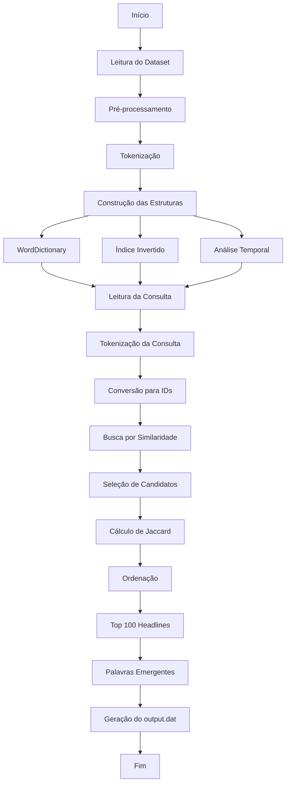

<a id="topo"></a>
# Monitoramento de Tendências em Manchetes de Notícias


---

# ⚠️ IMPORTANTE!

Antes de executar o projeto, certifique-se de que a estrutura de diretórios está organizada corretamente.

- O dataset **`abcnews-date-text.csv`** deve estar localizado na pasta:

```text
datasets/
```

- A consulta deve ser informada no arquivo:

```text
input/input.dat
```

Esse arquivo deve conter **uma única manchete**, que será utilizada como entrada para a busca de similaridade.

**Exemplo:**

```text
australia wins cricket match
```

- Após a execução, os resultados serão gerados automaticamente em:

```text
output/output.dat
```

O arquivo de saída contém:

- A manchete utilizada como consulta;
- Informações de desempenho (tempo de processamento);
- As palavras emergentes encontradas;
- O Top 100 de manchetes mais similares e seus respectivos índices de similaridade.

> **Observação:** O projeto foi desenvolvido para **Ubuntu** utilizando o compilador **g++** com suporte ao padrão **C++17** e **OpenMP**.

---

# 📑 Sumário

- [📖 Introdução](#-introdução)
- [🧠 Metodologia](#-metodologia)
  <details>
  <summary><b>Ver subseções da metodologia</b></summary>

  - [1. Dataset](#1-dataset)
    - [1.1 Leitura do Dataset](#11-leitura-do-dataset)

  - [2. Pré-processamento](#2-pré-processamento)
    - [2.1 Tokenização](#21-tokenização)
    - [2.2 Conversão para Letras Minúsculas](#22-conversão-para-letras-minúsculas)
    - [2.3 Separação dos Tokens](#23-separação-dos-tokens)
    - [2.4 Filtragem dos Tokens](#24-filtragem-dos-tokens)
    - [2.5 Processamento Paralelo](#25-processamento-paralelo)

  - [3. Estruturas de Dados](#3-estruturas-de-dados)
    - [3.1 Armazenamento das Manchetes](#31-armazenamento-das-manchetes)
    - [3.2 Dicionário de Palavras](#32-dicionário-de-palavras)
    - [3.3 Contabilização das Frequências](#33-contabilização-das-frequências)
    - [3.4 Construção do Índice Invertido](#34-construção-do-índice-invertido)
    - [3.5 Construção da Estrutura Temporal](#35-construção-da-estrutura-temporal)

  - [4. Busca por Similaridade](#4-busca-por-similaridade)
    - [4.1 Leitura da Consulta](#41-leitura-da-consulta)
    - [4.2 Processamento da Consulta](#42-processamento-da-consulta)
    - [4.3 Seleção das Manchetes Candidatas](#43-seleção-das-manchetes-candidatas)
    - [4.4 Cálculo da Similaridade](#44-cálculo-da-similaridade)
    - [4.5 Ordenação dos Resultados](#45-ordenação-dos-resultados)
    - [4.6 Seleção do Top 100](#46-seleção-do-top-100)

  - [5. Identificação das Palavras Emergentes](#5-identificação-das-palavras-emergentes)
    - [5.1 Divisão em Janelas Temporais](#51-divisão-em-janelas-temporais)
    - [5.2 Contabilização das Frequências](#52-contabilização-das-frequências)
    - [5.3 Cálculo do Crescimento Temporal](#53-cálculo-do-crescimento-temporal)
    - [5.4 Seleção das Palavras Emergentes](#54-seleção-das-palavras-emergentes)

  - [6. Geração dos Resultados](#6-geração-dos-resultados)
    - [6.1 Arquivo de Saída](#61-arquivo-de-saída)
    - [6.2 Informações da Consulta e Desempenho](#62-informações-da-consulta-e-desempenho)
    - [6.3 Palavras Emergentes](#63-palavras-emergentes)
    - [6.4 Top 100 de Manchetes Similares](#64-top-100-de-manchetes-similares)
    - [6.5 Encerramento da Execução](#65-encerramento-da-execução)

  </details>

- [🔄 Fluxo do Programa](#-fluxo-do-programa)
- [🗂️ Estrutura do Projeto](#️-estrutura-do-projeto)
- [🧱 Descrição das Classes](#-descrição-das-classes)
- [🖥️ Ambiente de Testes](#ambiente-de-teste)
- [📊 Resultados Obtidos](#-resultados-obtidos)
- [⏱️ Análise de Complexidade](#️-análise-de-complexidade)
- [▶️ Compilação e Execução](#️-compilação-e-execução)
- [✅ Conclusão](#-conclusão)
- [📚 Referências](#-referências)
- [📬 Contato](#-contato)

---

# 📖 Introdução

O crescimento contínuo da quantidade de notícias publicadas diariamente torna cada vez mais importante o desenvolvimento de técnicas capazes de organizar, analisar e recuperar informações de forma eficiente. Em grandes bases de dados, identificar notícias relacionadas a um mesmo assunto pode auxiliar na análise de eventos, no acompanhamento de tendências e na descoberta de temas em destaque ao longo do tempo.

Neste contexto, este projeto apresenta um sistema para monitoramento de tendências em manchetes de notícias, utilizando estruturas de dados eficientes e técnicas de processamento de texto. A solução foi desenvolvida utilizando a linguagem C++ e tem como base um conjunto de mais de um milhão de manchetes extraídas do dataset **ABC News Headlines**.

O sistema realiza o pré-processamento das manchetes, constrói um índice invertido para acelerar as consultas e utiliza o coeficiente de Jaccard para medir a similaridade entre a manchete informada pelo usuário e as notícias presentes na base de dados. Além disso, o projeto realiza uma análise temporal das palavras presentes no dataset, permitindo identificar termos que apresentaram crescimento ao longo do tempo e destacá-los como palavras emergentes.

Ao final da execução, o programa apresenta as cem manchetes mais semelhantes à consulta realizada, juntamente com as palavras emergentes relacionadas e informações sobre o desempenho da execução.

<p align="right">
<a href="#topo">⬆️ Voltar ao topo</a>
</p>

---

# 🧠 Metodologia

Para atender aos objetivos propostos, o sistema foi desenvolvido em etapas, organizando o processamento desde a leitura do conjunto de dados até a geração dos resultados finais. Cada etapa possui uma responsabilidade específica, permitindo que as estruturas de dados sejam construídas de forma organizada e utilizadas posteriormente na busca por similaridade entre manchetes e na identificação de palavras emergentes.

---

## 1. Dataset

Conforme especificado no enunciado do projeto, foi utilizado o dataset **ABC News Headlines**, disponibilizado no formato **CSV (Comma-Separated Values)**. Esse conjunto de dados é utilizado como base para a construção das estruturas de dados empregadas pelo sistema durante a busca por similaridade e pela análise temporal das palavras.

Cada registro do arquivo é composto por dois campos:

* **publish_date:** data associada à manchete;
* **headline_text:** texto da manchete.

A estrutura do arquivo pode ser observada no exemplo abaixo:

```text
publish_date,headline_text
20030219,aba decides against community broadcasting licence
20030219,act fire witnesses must be aware of defamation
20030219,a g calls for infrastructure protection summit
...
```

Embora cada registro possua um campo contendo a data da manchete, essa informação não é utilizada diretamente pelo sistema. Como o dataset encontra-se organizado cronologicamente, sua ordem é preservada durante o processamento e utilizada posteriormente para dividir as manchetes em janelas temporais.

### 1.1 Leitura do Dataset

A leitura do dataset corresponde à primeira etapa executada pelo sistema. Inicialmente, é criado um objeto da classe `ifstream` responsável pela abertura do arquivo `abcnews-date-text.csv`.

Antes de iniciar o processamento, o programa verifica se o arquivo foi aberto corretamente por meio da função `is_open()`. Caso a abertura falhe, uma mensagem de erro é exibida no terminal e a execução é encerrada utilizando `return 1`, impedindo que o restante do sistema seja executado sem uma base de dados válida.

Após a confirmação da abertura do arquivo, a primeira linha é descartada utilizando a função `getline()`, pois corresponde apenas ao cabeçalho do arquivo CSV (`publish_date,headline_text`).

Em seguida, todas as demais linhas são lidas sequencialmente através de um laço `while (getline(file, line))`. Cada linha é armazenada no vetor `lines`, preservando a posição original das manchetes no dataset para utilização nas etapas seguintes do processamento.

Após a leitura de todas as linhas, o arquivo é fechado através da função `file.close()`, encerrando a etapa de carregamento do dataset.

<p align="right">
<a href="#topo">⬆️ Voltar ao topo</a>
</p>

---

## 2. Pré-processamento

Após a leitura do dataset, todas as manchetes passam por uma etapa de pré-processamento antes da construção das estruturas de dados utilizadas pelo sistema. Essa etapa tem como objetivo transformar o texto original em um formato padronizado, facilitando as operações realizadas nas fases seguintes do processamento.

Todo o pré-processamento é realizado por meio da função `Tokenizer::tokenize()`, responsável por receber o texto de uma manchete e retornar um vetor contendo os tokens obtidos a partir desse texto.

Durante essa etapa, cada manchete é processada individualmente, sendo convertida em uma sequência de palavras que posteriormente será utilizada na construção do dicionário de palavras, do índice invertido, do cálculo das frequências e da busca por similaridade.

### 2.1 Tokenização

A tokenização corresponde ao processo de separação do texto da manchete em unidades menores, denominadas **tokens**.

No início da execução da função `Tokenizer::tokenize()`, são criadas duas estruturas auxiliares:

```cpp
std::vector<std::string> tokens;
std::string current;
```

O vetor `tokens` é responsável por armazenar todas as palavras identificadas durante o processamento da manchete, enquanto a variável `current` é utilizada para construir cada palavra caractere por caractere.

Em seguida, o texto recebido é percorrido utilizando um laço do tipo `for`, permitindo que cada caractere da manchete seja analisado individualmente.

```cpp
for (char c : text)
```

Durante esse percurso, a função `std::isalnum()` é utilizada para verificar se o caractere analisado é alfanumérico, ou seja, se corresponde a uma letra ou a um número.

Quando essa condição é satisfeita, o caractere é incorporado ao token que está sendo construído. Caso contrário, entende-se que foi encontrado o fim de uma palavra, iniciando o processo de validação do token construído até aquele momento.

### 2.2 Conversão para Letras Minúsculas

Sempre que um caractere alfanumérico é identificado, ele é convertido para letra minúscula utilizando a função `std::tolower()`.

```cpp
current += std::tolower(static_cast<unsigned char>(c));
```

Esse procedimento garante que palavras escritas com combinações diferentes de letras maiúsculas e minúsculas sejam armazenadas de forma padronizada.

Por exemplo, palavras como:

```text
Australia
AUSTRALIA
australia
```

passam a possuir a mesma representação textual, permitindo que sejam tratadas como uma única palavra durante o processamento do sistema.

### 2.3 Separação dos Tokens

A construção de cada token continua enquanto os caracteres analisados forem considerados alfanuméricos.

Quando é encontrado um caractere que não pertence a esse conjunto, como espaços, vírgulas, pontos ou outros símbolos de pontuação, considera-se que a palavra foi finalizada.

Nesse momento, o conteúdo armazenado na variável `current` é avaliado e, caso seja considerado válido, é inserido no vetor `tokens`.

Após essa verificação, a variável `current` é esvaziada por meio da função `clear()`, permitindo que a próxima palavra seja construída.

Ao término do percurso da string, o método realiza uma nova verificação para garantir que a última palavra da manchete também seja adicionada ao vetor, caso não exista um caractere separador ao final do texto.

### 2.4 Filtragem dos Tokens

Antes de inserir uma palavra no vetor `tokens`, o sistema verifica seu tamanho utilizando a condição:

```cpp
if (current.size() > 3)
```

Somente palavras com mais de três caracteres são consideradas válidas e adicionadas ao vetor de tokens.

Essa verificação é realizada tanto durante o processamento da string quanto após o término do laço de repetição, garantindo que todas as palavras armazenadas atendam ao mesmo critério de tamanho.

Ao final da execução da função, é retornado um vetor contendo apenas os tokens válidos extraídos da manchete.

### 2.5 Processamento Paralelo

Após a leitura completa do dataset, o pré-processamento das manchetes é realizado de forma paralela utilizando a biblioteca **OpenMP**.

Inicialmente, é criado um vetor denominado `allTokens`, responsável por armazenar os tokens gerados para cada manchete presente no dataset.

```cpp
vector<vector<string>> allTokens(lines.size());
```

Em seguida, o sistema utiliza a diretiva:

```cpp
#pragma omp parallel for
```

para distribuir as iterações do laço entre as múltiplas threads disponíveis.

Durante cada iteração, o texto da manchete é extraído da linha correspondente do dataset e enviado para a função `Tokenizer::tokenize()`, responsável por realizar todo o pré-processamento descrito anteriormente.

Os tokens obtidos são armazenados na posição correspondente do vetor `allTokens`, preservando a associação entre cada manchete e suas respectivas palavras.

A utilização do processamento paralelo permite que diversas manchetes sejam tokenizadas simultaneamente, reduzindo o tempo necessário para essa etapa quando comparado a uma execução sequencial.

<p align="right">
<a href="#topo">⬆️ Voltar ao topo</a>
</p>

---

## 3. Estruturas de Dados

Após a etapa de pré-processamento, o sistema inicia a construção das estruturas de dados que serão utilizadas durante toda a execução da aplicação. Essas estruturas têm como objetivo organizar as informações extraídas das manchetes, permitindo que as consultas sejam realizadas de forma eficiente e reduzindo a quantidade de operações necessárias durante a busca por similaridade.

Durante essa etapa, cada manchete processada é percorrida palavra por palavra. Para cada token obtido, são executadas diferentes operações que alimentam as estruturas utilizadas pelo sistema.

### 3.1 Armazenamento das Manchetes

Para cada linha do dataset, o sistema cria uma estrutura responsável por armazenar o texto original da manchete.

Em seguida, cada palavra produzida durante a tokenização é convertida para um identificador numérico e armazenada juntamente com a manchete. Após todos os identificadores serem inseridos, eles são ordenados em ordem crescente utilizando a função `sort()`, preparando a estrutura para as etapas posteriores de comparação entre manchetes.

Ao final desse processo, cada manchete passa a possuir duas representações: o texto original, utilizado na apresentação dos resultados, e a representação numérica das palavras, utilizada durante os cálculos realizados pelo sistema.

### 3.2 Dicionário de Palavras

Durante o processamento de cada manchete, todas as palavras obtidas pela tokenização são convertidas para identificadores numéricos.

Sempre que uma palavra é encontrada, o sistema verifica se ela já possui um identificador associado. Caso já exista, esse identificador é reutilizado. Caso contrário, um novo identificador é criado e passa a representar essa palavra durante toda a execução do programa.

A utilização de identificadores inteiros reduz a necessidade de comparar strings repetidamente, tornando mais eficientes as operações realizadas nas etapas seguintes do processamento.

### 3.3 Contabilização das Frequências

Após obter o identificador de cada palavra, o sistema incrementa sua frequência global.

Essa contagem é realizada durante a leitura das manchetes e permite conhecer quantas vezes cada palavra aparece em todo o conjunto de dados. As frequências ficam disponíveis para utilização em outras etapas do processamento sempre que necessário.

### 3.4 Construção do Índice Invertido

Simultaneamente ao processamento das palavras, o sistema constrói um índice invertido.

Para cada identificador de palavra, é armazenada a posição da manchete onde essa palavra aparece.

Ao final da leitura do dataset, o índice permite localizar rapidamente todas as manchetes que contêm uma determinada palavra, eliminando a necessidade de percorrer todas as notícias durante cada consulta realizada pelo usuário.

### 3.5 Construção da Estrutura Temporal

Durante o processamento das manchetes, o sistema também registra a frequência de cada palavra em diferentes janelas temporais.

Inicialmente, é determinada a janela temporal correspondente à manchete processada. Em seguida, para cada palavra presente nessa manchete, sua frequência é incrementada na janela correspondente.

Essas informações serão utilizadas posteriormente para calcular o crescimento temporal das palavras e identificar aquelas que apresentam maior aumento de ocorrência ao longo do dataset.


<p align="right">
<a href="#topo">⬆️ Voltar ao topo</a>
</p>

---
## 4. Busca por Similaridade

Após a construção das estruturas de dados, o sistema realiza a busca pelas manchetes mais semelhantes à consulta informada pelo usuário. Essa etapa utiliza a representação numérica das palavras para comparar a consulta com as manchetes presentes no dataset, retornando as cem mais similares de acordo com o coeficiente de Jaccard.

### 4.1 Leitura da Consulta

A consulta é fornecida por meio do arquivo `input/input.dat`.

Inicialmente, o sistema abre esse arquivo utilizando um objeto da classe `ifstream`. Após verificar que a abertura foi realizada com sucesso, a primeira linha do arquivo é lida utilizando a função `getline()` e armazenada na variável `queryText`.

O texto obtido representa a manchete que será utilizada como referência durante a busca por similaridade.

### 4.2 Processamento da Consulta

Após a leitura da consulta, o texto passa pelo mesmo processo de pré-processamento aplicado às manchetes do dataset.

Inicialmente, a função `Tokenizer::tokenize()` é utilizada para dividir a consulta em tokens válidos. Em seguida, cada token é convertido para seu respectivo identificador numérico utilizando o dicionário de palavras construído durante o processamento do dataset.

Os identificadores obtidos são armazenados no vetor `queryWordIds`, que posteriormente é ordenado utilizando a função `sort()`. Essa representação numérica da consulta é utilizada durante todas as comparações realizadas pelo sistema.

Antes de iniciar a busca, o programa verifica se a consulta possui pelo menos uma palavra válida. Caso contrário, a execução é encerrada e uma mensagem informando que a consulta é inválida é apresentada ao usuário.

### 4.3 Seleção das Manchetes Candidatas

A busca por similaridade não é realizada sobre todas as manchetes do dataset.

Inicialmente, o sistema percorre todas as palavras presentes na consulta. Para cada identificador de palavra, é realizada uma busca no índice invertido para localizar as manchetes que contêm essa palavra.

Sempre que uma manchete é encontrada, seu identificador é inserido em um `unordered_set` denominado `candidateIds`.

Como essa estrutura não permite elementos repetidos, cada manchete é armazenada apenas uma vez, mesmo que compartilhe várias palavras com a consulta.

Ao final dessa etapa, o conjunto de candidatos contém apenas as manchetes que possuem pelo menos uma palavra em comum com a consulta, reduzindo significativamente a quantidade de comparações necessárias durante o cálculo da similaridade.

### 4.4 Cálculo da Similaridade

Após determinar o conjunto de manchetes candidatas, o sistema calcula a similaridade entre a consulta e cada uma delas utilizando o coeficiente de Jaccard.

Para cada candidato, são criados dois conjuntos (`unordered_set`), um contendo as palavras da consulta e outro contendo as palavras da manchete analisada.

Em seguida, o sistema percorre os elementos do primeiro conjunto para determinar quantas palavras pertencem simultaneamente aos dois conjuntos, obtendo assim o tamanho da interseção.

Posteriormente, o tamanho da união é calculado pela expressão:

```text
|A| + |B| − |A ∩ B|
```

Por fim, a similaridade é determinada pela fórmula:

```text
|A ∩ B|
─────────
|A ∪ B|
```

Caso a união seja igual a zero, a função retorna o valor `0.0`, evitando uma divisão por zero.

Quanto maior o valor obtido, maior é a quantidade de palavras compartilhadas entre a consulta e a manchete analisada.

### 4.5 Ordenação dos Resultados

Após calcular a similaridade de todas as manchetes candidatas, o sistema armazena os resultados em um vetor composto por pares contendo o identificador da manchete e seu respectivo valor de similaridade.

Esse vetor é ordenado em ordem decrescente utilizando a função `sort()`, considerando exclusivamente o valor da similaridade.

Dessa forma, as manchetes mais semelhantes passam a ocupar as primeiras posições do vetor.

### 4.6 Seleção do Top 100

Após a ordenação dos resultados, o sistema verifica a quantidade de manchetes encontradas.

Caso o número de resultados seja superior ao valor informado pelo parâmetro `k`, o vetor é reduzido utilizando a função `resize()`, preservando apenas os cem primeiros elementos.

Dessa forma, o método retorna somente as cem manchetes com maior coeficiente de similaridade em relação à consulta realizada pelo usuário, atendendo ao requisito estabelecido para o projeto.

<p align="right">
<a href="#topo">⬆️ Voltar ao topo</a>
</p>


---

## 5. Identificação das Palavras Emergentes

Além da busca por similaridade entre manchetes, o sistema realiza uma análise temporal das palavras presentes nas manchetes mais similares à consulta. Essa etapa tem como objetivo identificar, entre as palavras presentes nas manchetes retornadas pela busca, aquelas que apresentaram maior crescimento ao longo do período representado pelo dataset.

Para isso, durante o processamento das manchetes é construída uma estrutura que contabiliza a frequência de cada palavra em diferentes janelas temporais. Após a busca por similaridade, essas informações são utilizadas para calcular o crescimento de cada palavra e selecionar aquelas consideradas emergentes.

### 5.1 Divisão em Janelas Temporais

Durante o processamento do dataset, cada manchete é associada a uma das cinco janelas temporais utilizadas pelo sistema.

A determinação da janela é realizada de acordo com a posição da manchete no vetor `lines`, por meio da expressão:

```cpp
int window = (5 * i) / lines.size();
```

Dessa forma, o conjunto de manchetes é dividido em cinco partes de tamanhos aproximadamente iguais, preservando a ordem cronológica do dataset durante a análise temporal.

Após determinar a janela correspondente, todas as palavras presentes na manchete têm suas frequências registradas na posição correspondente.

### 5.2 Contabilização das Frequências

Para cada palavra processada, o sistema incrementa sua frequência na janela temporal correspondente utilizando o método `add()`.

Caso a palavra ainda não tenha sido registrada anteriormente, é criado um vetor contendo cinco posições inicializadas com zero, representando as cinco janelas temporais utilizadas durante a análise.

Em seguida, a frequência da palavra é incrementada na posição correspondente à janela da manchete processada.

Ao final da leitura do dataset, cada palavra passa a possuir um vetor contendo sua frequência em cada uma das cinco janelas temporais.

### 5.3 Cálculo do Crescimento Temporal

Após a busca pelas manchetes mais similares, o sistema percorre todas as palavras presentes nessas manchetes e calcula seu crescimento temporal.

O cálculo é realizado utilizando apenas a frequência da primeira e da última janela temporal, de acordo com a expressão:

```text
(J5 − J1)
─────────
(J1 + 1)
```

onde:

* **J1** representa a frequência da palavra na primeira janela temporal;
* **J5** representa a frequência da palavra na última janela temporal.

A soma de uma unidade ao denominador evita divisões por zero quando a palavra não ocorre na primeira janela.

Quanto maior o valor obtido, maior foi o crescimento da ocorrência dessa palavra ao longo do período representado pelo dataset.

### 5.4 Seleção das Palavras Emergentes

Após calcular o crescimento temporal das palavras presentes nas manchetes similares, o sistema armazena os resultados em um vetor composto pelo identificador da palavra e seu respectivo valor de crescimento.

Em seguida, esse vetor é ordenado em ordem decrescente de acordo com o crescimento temporal.

Por fim, são selecionadas as cem primeiras palavras do ranking. Para cada uma delas, o sistema utiliza o dicionário de palavras para recuperar o texto original correspondente ao identificador numérico, permitindo que o resultado seja apresentado ao usuário no arquivo `output/output.dat`.

<p align="right">
<a href="#topo">⬆️ Voltar ao topo</a>
</p>

---

## 6. Geração dos Resultados

Após concluir todas as etapas de processamento, o sistema reúne as informações obtidas durante a execução e gera um arquivo contendo os resultados da consulta realizada pelo usuário.

Os resultados são gravados no arquivo `output/output.dat`, permitindo que todas as informações produzidas pelo sistema fiquem organizadas em um único documento.

Além da geração do arquivo de saída, o programa também informa o tempo total de execução no terminal, permitindo acompanhar o desempenho geral da aplicação.

### 6.1 Arquivo de Saída

A geração dos resultados inicia com a criação de um objeto da classe `ofstream`, responsável por criar e escrever o arquivo `output/output.dat`.

Antes de iniciar a escrita, o sistema verifica se o arquivo foi criado corretamente. Caso ocorra algum erro durante essa etapa, uma mensagem é exibida no terminal e a execução é encerrada.

Após a validação, todas as informações produzidas durante o processamento passam a ser gravadas sequencialmente no arquivo.

### 6.2 Informações da Consulta e Desempenho

Inicialmente, o sistema registra a consulta fornecida pelo usuário.

Em seguida, são apresentados os tempos de execução medidos durante o processamento, incluindo:

* tempo gasto na leitura e tokenização do dataset;
* tempo gasto na busca por similaridade;
* tempo total de execução do programa.

Esses valores são obtidos utilizando a biblioteca `<chrono>`, permitindo avaliar o desempenho das principais etapas do sistema.

### 6.3 Palavras Emergentes

Após registrar as informações de desempenho, o sistema apresenta o conjunto de palavras emergentes identificado durante a análise temporal.

Após registrar as informações de desempenho, o sistema apresenta o ranking das palavras emergentes identificadas durante a análise temporal.

As palavras são organizadas em ordem decrescente de acordo com o valor de crescimento temporal calculado pelo sistema. Em seguida, são exibidas as cem primeiras posições do ranking.

Para cada palavra, são apresentados:

- sua posição no ranking;
- o texto original da palavra, recuperado por meio do dicionário de palavras;
- o valor do crescimento temporal calculado.

Um exemplo do formato apresentado é mostrado a seguir:

```text
1. responds (6.12)
2. australia (2.82)
3. cricket (2.24)
4. allegations (1.44)
5. trademarks (0.50)
```

Essa informação permite identificar quais palavras, entre aquelas presentes nas manchetes mais similares à consulta, apresentaram maior crescimento ao longo das janelas temporais analisadas.

### 6.4 Top 100 de Manchetes Similares

Na sequência, o sistema apresenta as cem manchetes mais semelhantes à consulta realizada pelo usuário.

Para cada resultado, são exibidos:

* o coeficiente de similaridade calculado pelo método de Jaccard;
* o texto original da manchete.

As manchetes são apresentadas na mesma ordem em que foram retornadas pela etapa de busca por similaridade, ou seja, da maior para a menor similaridade.

### 6.5 Encerramento da Execução

Após finalizar a escrita do arquivo de saída, o sistema fecha o arquivo utilizando a função `close()`.

Por fim, o tempo total de execução é apresentado no terminal, permitindo acompanhar o desempenho geral da aplicação sem a necessidade de abrir o arquivo de resultados.

Com isso, a execução do programa é encerrada por meio da instrução `return 0`, indicando que todas as etapas foram concluídas com sucesso.

<p align="right">
<a href="#topo">⬆️ Voltar ao topo</a>
</p>

---

# 🔄 Fluxo do Programa


O fluxograma apresentado descreve o funcionamento geral do sistema desenvolvido para análise de similaridade entre manchetes e identificação de palavras emergentes. Inicialmente, é realizada a leitura do dataset `abcnews-date-text.csv`, contendo as manchetes que servirão como base para todas as etapas do processamento.

Em seguida, cada manchete passa pelo processo de pré-processamento, no qual o texto é tokenizado e convertido para letras minúsculas. As palavras obtidas são utilizadas para construir as estruturas de dados empregadas pelo sistema, incluindo o dicionário de palavras, o índice invertido, o registro da frequência das palavras e a estrutura responsável pela análise temporal.

Após essa etapa, o sistema realiza a leitura da consulta fornecida pelo usuário por meio do arquivo `input/input.dat`. A consulta é submetida ao mesmo processo de pré-processamento utilizado no dataset e suas palavras são convertidas para identificadores numéricos.

Com a consulta processada, o sistema utiliza o índice invertido para localizar as manchetes candidatas, ou seja, aquelas que compartilham pelo menos uma palavra com a consulta. Em seguida, é calculado o coeficiente de similaridade de Jaccard entre a consulta e cada uma das manchetes candidatas.

Após o cálculo da similaridade, os resultados são ordenados em ordem decrescente e são selecionadas as cem manchetes com maior grau de similaridade. A partir dessas manchetes, o sistema realiza a análise temporal das palavras, calculando o crescimento de cada uma ao longo das cinco janelas temporais definidas durante o processamento do dataset, permitindo identificar as palavras emergentes.

Por fim, todas as informações geradas durante a execução, incluindo os tempos de processamento, o ranking das palavras emergentes e as cem manchetes mais similares à consulta, são gravadas no arquivo `output/output.dat`. Após concluir a escrita do arquivo, o programa encerra sua execução.

---

## 🗂️ Estrutura do Projeto

O projeto foi organizado de forma modular, separando as diferentes responsabilidades em diretórios específicos. Essa organização facilita a manutenção do código, melhora sua legibilidade e permite que cada componente do sistema seja desenvolvido de forma independente.

A estrutura de diretórios adotada é apresentada a seguir:

```text
📁 News-Trend-Analyzer/
├── 📁 datasets/
│   └── abcnews-date-text.csv
│
├── 📁 include/
│   ├── 📁 core/
│   │   ├── Headline.hpp
│   │   ├── InvertedIndex.hpp
│   │   ├── TemporalAnalyzer.hpp
│   │   └── WordDictionary.hpp
│   │
│   ├── 📁 io/
│   │   └── CSVReader.hpp
│   │
│   ├── 📁 ranking/
│   │   ├── TopK.hpp
│   │   └── WordFrequency.hpp
│   │
│   ├── 📁 similarity/
│   │   ├── Jaccard.hpp
│   │   └── SimilaritySearch.hpp
│   │
│   ├── 📁 text/
│   │   └── Tokenizer.hpp
│   │
│   └── 📁 utils/
│       └── Benchmark.hpp
│
├── 📁 input/
│   └── input.dat
│
├── 📁 output/
│   └── output.dat
│
├── 📁 src/
│   ├── 📁 core/
│   │   ├── Headline.cpp
│   │   ├── InvertedIndex.cpp
│   │   ├── TemporalAnalyzer.cpp
│   │   └── WordDictionary.cpp
│   │
│   ├── 📁 io/
│   │   └── CSVReader.cpp
│   │
│   ├── 📁 ranking/
│   │   ├── TopK.cpp
│   │   └── WordFrequency.cpp
│   │
│   ├── 📁 similarity/
│   │   ├── Jaccard.cpp
│   │   └── SimilaritySearch.cpp
│   │
│   ├── 📁 text/
│   │   └── Tokenizer.cpp
│   │
│   ├── 📁 utils/
│   │   └── Benchmark.cpp
│   │
│   └── main.cpp
│
├── Makefile
└── README.md
```

Os arquivos localizados na pasta `include/` contêm as declarações das classes, funções e estruturas utilizadas pelo sistema, enquanto a pasta `src/` reúne suas respectivas implementações.

O diretório `datasets/` armazena o conjunto de dados utilizado pelo sistema durante o processamento das manchetes. Já a pasta `input/` contém o arquivo `input.dat`, responsável por armazenar a consulta fornecida pelo usuário, enquanto a pasta `output/` é utilizada para armazenar o arquivo `output.dat`, contendo os resultados gerados pelo programa.

O arquivo `main.cpp` é responsável por controlar o fluxo principal da aplicação, coordenando todas as etapas do processamento, desde a leitura do dataset até a geração do arquivo de saída.

O `Makefile` automatiza o processo de compilação do projeto, permitindo a construção do executável e sua execução de forma simplificada em ambientes Linux.

Essa organização modular contribui para uma melhor separação de responsabilidades, facilitando a compreensão do código, sua manutenção e a inclusão de novas funcionalidades.

<p align="right">
<a href="#topo">⬆️ Voltar ao topo</a>
</p>

---

## 🧱 Descrição das Classes

O sistema foi desenvolvido de forma modular, distribuindo as responsabilidades entre diferentes classes. Cada uma delas desempenha uma função específica durante o processamento das manchetes, contribuindo para uma melhor organização do código e facilitando sua manutenção.

### 📰 Headline

A classe `Headline` representa uma manchete do dataset.

Cada objeto dessa classe armazena o texto original da manchete e um vetor contendo os identificadores numéricos (`wordIds`) correspondentes às palavras obtidas após o pré-processamento.

Essa representação permite preservar o texto original para apresentação dos resultados, enquanto o processamento interno é realizado utilizando apenas identificadores inteiros, reduzindo o custo das comparações.

---

### 📚 WordDictionary

A classe `WordDictionary` é responsável por realizar o mapeamento entre palavras e identificadores numéricos.

Sempre que uma nova palavra é encontrada durante o processamento do dataset, um identificador único é criado e associado a ela. Caso a palavra já exista, o identificador previamente atribuído é reutilizado.

Além disso, a classe permite recuperar o texto original de uma palavra a partir de seu identificador, funcionalidade utilizada durante a geração dos resultados.

---

### 📊 WordFrequency

A classe `WordFrequency` é responsável por contabilizar a frequência de ocorrência de cada palavra no dataset.

Para isso, mantém uma estrutura que associa o identificador de cada palavra ao número de vezes em que ela aparece nas manchetes processadas.

A classe também disponibiliza métodos para consultar a frequência de uma palavra específica e recuperar as palavras mais frequentes quando necessário.

---

### 📈 TemporalAnalyzer

A classe `TemporalAnalyzer` é responsável por armazenar a frequência das palavras ao longo das diferentes janelas temporais utilizadas pelo sistema.

Durante o processamento do dataset, cada ocorrência de uma palavra é registrada na janela temporal correspondente. Posteriormente, essas informações são utilizadas para calcular o crescimento temporal das palavras e identificar aquelas que apresentaram maior crescimento entre as manchetes mais similares à consulta.

---

### 📝 Tokenizer

A classe `Tokenizer` concentra as rotinas de pré-processamento textual utilizadas pelo sistema.

Sua principal responsabilidade é transformar o texto das manchetes em uma sequência de palavras válidas, realizando a conversão para letras minúsculas, separando os termos e descartando tokens com até três caracteres.

Esse mesmo processo é aplicado tanto às manchetes do dataset quanto à consulta fornecida pelo usuário, garantindo uniformidade durante o cálculo da similaridade.

---

### 🤝 SimilaritySearch

A classe `SimilaritySearch` implementa o processo de busca pelas manchetes mais semelhantes à consulta.

Inicialmente, utiliza o índice invertido para identificar apenas as manchetes que compartilham pelo menos uma palavra com a consulta. Em seguida, calcula a similaridade entre a consulta e cada manchete candidata, ordena os resultados e retorna as cem manchetes com maior grau de similaridade.

Essa abordagem reduz significativamente a quantidade de comparações realizadas durante a busca.

---

### 📐 Jaccard

A classe `Jaccard` implementa o cálculo do coeficiente de similaridade utilizado pelo sistema.

O cálculo é realizado considerando a razão entre a quantidade de palavras comuns e o total de palavras distintas presentes na consulta e na manchete analisada.

O valor obtido varia entre 0 e 1, sendo utilizado para medir o grau de similaridade entre duas manchetes.

---

A separação do sistema em classes com responsabilidades bem definidas contribui para uma arquitetura modular, favorecendo a organização do código, sua manutenção e a possibilidade de futuras expansões sem comprometer os demais componentes do sistema.

<p align="right">
<a href="#topo">⬆️ Voltar ao topo</a>
</p>


---

## 🖥️ Ambiente de Testes

Todos os experimentos e medições de desempenho apresentados neste relatório foram realizados em um computador com a seguinte configuração:

| Componente | Especificação |
|------------|---------------|
| 💻 Sistema Operacional | Ubuntu 24.04.4 LTS |
| 🧠 Processador | Intel® Core™ i5-13420H (13ª geração) |
| ⚙️ Núcleos / Threads | 8 núcleos e 12 threads |
| 🧮 Memória RAM | 8 GB (7,5 GiB reconhecidos pelo sistema) |
| 🔨 Compilador | g++ 13.3.0 |
| 🛠️ Ferramentas de Build | CMake 3.28.3 e Make |
| 📚 Padrão da Linguagem | C++17 |

Os testes foram executados em ambiente local utilizando o sistema operacional Ubuntu 24.04.4 LTS. O projeto foi compilado com o compilador **g++ 13.3.0**, seguindo o padrão **C++17**, com **CMake** e **Make** como ferramentas de compilação.

Todos os experimentos foram realizados na mesma máquina, mantendo a mesma configuração de hardware e software para garantir a consistência das medições de desempenho apresentadas na seção de resultados.

<p align="right">
<a href="#topo">⬆️ Voltar ao topo</a>
</p>

---

# 📊 Resultados Obtidos

## 🎯 Motivação da Análise

Após a implementação do sistema, foram realizados diferentes testes com o objetivo de verificar seu funcionamento em cenários distintos de busca. Os experimentos buscaram avaliar tanto a qualidade das manchetes recuperadas quanto o desempenho do algoritmo durante a execução.

Em cada teste foram analisados os seguintes aspectos:

* qualidade das manchetes retornadas;
* valores de similaridade calculados pelo coeficiente de Jaccard;
* palavras emergentes identificadas pelo sistema;
* tempo de leitura e tokenização;
* tempo de busca por similaridade;
* tempo total de execução.

Todos os experimentos foram executados utilizando o mesmo dataset, variando apenas a consulta fornecida ao programa por meio do arquivo `input/input.dat`.

---

## 🔬 Metodologia dos Testes

Foram selecionadas quatro consultas pertencentes a contextos distintos, permitindo avaliar o comportamento do sistema em diferentes tipos de pesquisa.

Cada execução produz três conjuntos principais de informações:

* as **100 manchetes** mais semelhantes à consulta;
* as **100 palavras emergentes** encontradas nas manchetes recuperadas;
* os tempos de processamento e de busca.

Os testes foram realizados no ambiente descrito na seção **🖥️ Ambiente de Testes**, mantendo a mesma configuração de hardware e software durante todas as as execuções.

---

## 📈 Teste 1 — Consulta sobre esporte

**Consulta**

```text
australia wins cricket match
```

**Objetivo**

Avaliar a capacidade do sistema em localizar manchetes relacionadas a um evento esportivo.

**Resultados observados**

* Tempo de leitura e tokenização: **1922 ms**
* Tempo de busca: **19 ms**
* Tempo total: **2106 ms**
* Maior similaridade encontrada: **0,6000**

As manchetes retornadas tratam predominantemente de partidas de críquete envolvendo a Austrália, evidenciando que o algoritmo conseguiu recuperar documentos relacionados ao contexto da consulta.

As palavras emergentes apresentaram forte relação com o tema esportivo, destacando termos como *australia*, *cricket*, *queensland*, *christchurch* e *cummins*.

**Conclusão**

O sistema apresentou resultados coerentes com a consulta realizada, recuperando manchetes semanticamente semelhantes e identificando palavras relevantes dentro do conjunto retornado.

---

## 📈 Teste 2 — Consulta sobre política

**Consulta**

```text
australia election government
```

**Objetivo**

Verificar o comportamento do sistema para consultas relacionadas ao contexto político.

**Resultados observados**

* Tempo de leitura e tokenização: **1406 ms**
* Tempo de busca: **24 ms**
* Tempo total: **1570 ms**
* Maior similaridade encontrada: **0,5000**

As manchetes recuperadas abordam eleições, governos e política australiana, demonstrando que a busca conseguiu identificar documentos pertencentes ao mesmo contexto da consulta.

Entre as palavras emergentes destacam-se *government*, *election*, *morrison*, *turnbull* e *xenophon*, indicando crescimento temporal de termos relacionados ao cenário político.

**Conclusão**

O sistema manteve boa qualidade na recuperação das manchetes, mesmo em um domínio temático diferente do teste anterior.

---

## 📈 Teste 3 — Consulta sobre incêndios florestais

**Consulta**

```text
bushfire victoria
```

**Objetivo**

Avaliar o comportamento da busca para uma consulta mais específica.

**Resultados observados**

* Tempo de leitura e tokenização: **1330 ms**
* Tempo de busca: **4 ms**
* Tempo total: **1479 ms**
* Maior similaridade encontrada: **0,6667**

As manchetes recuperadas tratam diretamente de incêndios florestais ocorridos no estado de Victoria, apresentando alto grau de correspondência com a consulta.

As palavras emergentes identificadas incluem *victoria*, *bushfire*, *mallacoota*, *heatwave* e *fireground*, todas relacionadas ao tema pesquisado.

**Conclusão**

Mesmo para uma consulta mais específica, o sistema conseguiu localizar rapidamente documentos altamente relacionados, apresentando o menor tempo de busca entre todos os testes realizados.

---

## 📈 Teste 4 — Consulta sobre ocorrências policiais

**Consulta**

```text
police arrest
```

**Objetivo**

Avaliar o comportamento do sistema diante de uma consulta composta por termos bastante frequentes no dataset.

**Resultados observados**

* Tempo de leitura e tokenização: **1362 ms**
* Tempo de busca: **22 ms**
* Tempo total: **1535 ms**
* Maior similaridade encontrada: **1,0000**

A primeira manchete retornada foi exatamente **"police arrest man"**, resultando em similaridade igual a **1,0000**, enquanto as demais manchetes permaneceram diretamente relacionadas ao contexto policial.

As palavras emergentes incluem *assange*, *tasered*, *carjacking*, *hacking* e *arrest*, indicando a predominância desse tema entre as manchetes recuperadas.

**Conclusão**

Mesmo utilizando palavras bastante frequentes, o sistema manteve baixo tempo de resposta e conseguiu ranquear corretamente as manchetes mais relevantes.

---

## 📊 Resumo dos Testes

| Teste | Consulta                      | Busca | Tempo Total | Maior Similaridade |
| :---: | ----------------------------- | :---: | :---------: | :----------------: |
|   1   | australia wins cricket match  | 19 ms |   2106 ms   |       0,6000       |
|   2   | australia election government | 24 ms |   1570 ms   |       0,5000       |
|   3   | bushfire victoria             |  4 ms |   1479 ms   |       0,6667       |
|   4   | police arrest                 | 22 ms |   1535 ms   |       1,0000       |

---

## 🔍 Discussão dos Resultados

Os resultados obtidos mostram que o sistema apresentou desempenho consistente para todas as consultas realizadas. Embora os temas pesquisados fossem distintos — envolvendo esportes, política, incêndios florestais e ocorrências policiais — os tempos de execução permaneceram próximos entre si.

Em todas as consultas, a etapa de leitura e tokenização foi responsável pela maior parte do tempo total de processamento, variando entre aproximadamente **1,3 s** e **1,9 s**. Em contrapartida, a busca por similaridade foi executada em um intervalo de apenas **4 ms** a **24 ms**, evidenciando que a recuperação das manchetes é bastante eficiente.

As manchetes retornadas apresentaram alta relação com os termos pesquisados, e as palavras emergentes identificadas também foram coerentes com o contexto de cada consulta. Isso indica que o cálculo de similaridade baseado no coeficiente de Jaccard e o método utilizado para identificar palavras emergentes conseguiram representar adequadamente os assuntos pesquisados.

Os testes também demonstraram que o sistema mantém bom desempenho mesmo retornando as **100 manchetes mais semelhantes** e as **100 palavras emergentes**, sem aumento significativo no tempo de busca. Dessa forma, observa-se que o principal custo computacional está concentrado na etapa inicial de processamento da base de dados, enquanto as consultas são realizadas de forma rápida após a construção das estruturas utilizadas pelo sistema.


---
# ⏱️ Análise de Complexidade

A análise de complexidade permite compreender o custo computacional das principais etapas executadas pelo sistema, desde a leitura do dataset até a geração dos resultados finais.

Como o projeto processa um conjunto de dados com mais de um milhão de manchetes, foi necessário utilizar estruturas de dados eficientes para reduzir o tempo de resposta das consultas. Dessa forma, cada etapa do algoritmo pode ser analisada separadamente.

---

## 🔍 1. Leitura do Dataset

A primeira etapa consiste na leitura do arquivo CSV contendo todas as manchetes. Cada linha do arquivo é lida apenas uma única vez e armazenada em memória para posterior processamento.

Considerando **N** como o número de manchetes presentes no dataset, essa etapa possui complexidade:

**O(N)**

---

## 📝 2. Tokenização e Pré-processamento

Após a leitura, cada manchete é submetida ao processo de tokenização. Durante essa etapa, o algoritmo percorre todos os caracteres do texto, convertendo letras maiúsculas para minúsculas, separando as palavras e descartando tokens com até três caracteres.

Como cada caractere é processado apenas uma vez, essa etapa possui custo proporcional ao número total de caracteres processados.

Considerando **T** como o número total de caracteres do dataset, a complexidade é:

**O(T)**

---

## 🗂️ 3. Construção das Estruturas de Dados

Depois da tokenização, cada palavra é utilizada para construir as estruturas responsáveis pelo funcionamento do sistema.

Para cada token são realizadas operações de:

- obtenção ou criação do identificador da palavra;
- armazenamento do identificador na manchete correspondente;
- atualização da frequência da palavra;
- inserção da manchete no índice invertido;
- atualização das informações utilizadas pela análise temporal.

Como essas operações possuem custo constante em média, essa etapa depende apenas da quantidade total de palavras processadas.

Considerando **W** como o número total de palavras após o pré-processamento, a complexidade é:

**O(W)**

---

## 🔎 4. Busca por Similaridade

Durante a consulta, o sistema utiliza o índice invertido para localizar apenas as manchetes que compartilham pelo menos uma palavra com a consulta.

Essa estratégia evita percorrer todas as manchetes do dataset, reduzindo significativamente o número de comparações necessárias.

Considerando **C** como o número de candidatos encontrados, essa etapa possui complexidade:

**O(C)**

---

## 📐 5. Cálculo da Similaridade

Para cada manchete candidata é calculado o coeficiente de similaridade de Jaccard entre a consulta e a manchete.

Considerando **M** como o número médio de palavras presentes em cada manchete, essa etapa possui complexidade:

**O(C × M)**

Como as manchetes são relativamente curtas, o valor de **M** permanece pequeno, contribuindo para um baixo tempo de processamento.

---

## 📊 6. Ordenação dos Resultados

Após o cálculo das similaridades, os candidatos são ordenados em ordem decrescente para que sejam retornadas apenas as manchetes mais semelhantes.

Considerando **C** candidatos, essa ordenação possui complexidade:

**O(C log C)**

---

## 📈 7. Identificação das Palavras Emergentes

Depois de recuperar as manchetes mais semelhantes, o sistema identifica todas as palavras presentes nesses resultados e calcula sua taxa de crescimento utilizando a análise temporal.

Em seguida, essas palavras são ordenadas para selecionar aquelas que apresentam maior crescimento.

Considerando **E** como o número de palavras distintas presentes nas manchetes recuperadas, essa etapa possui complexidade:

**O(E log E)**

---

## 📌 Complexidade Geral

Considerando todas as etapas executadas pelo sistema, a complexidade total pode ser representada por:

**O(N + T + W + C × M + C log C + E log E)**

em que:

- **N** representa o número de manchetes do dataset;
- **T** representa o número total de caracteres processados;
- **W** representa o número total de palavras após o pré-processamento;
- **C** representa o número de manchetes candidatas recuperadas pelo índice invertido;
- **M** representa o número médio de palavras por manchete;
- **E** representa o número de palavras distintas analisadas na etapa de identificação das palavras emergentes.

---

## 🚀 Considerações Finais

A etapa de maior custo computacional corresponde ao pré-processamento inicial do dataset, realizado apenas uma vez durante a execução do programa.

Após a construção das estruturas de dados, o uso do índice invertido reduz significativamente o número de comparações necessárias durante as consultas, permitindo que a busca por similaridade seja realizada em poucos milissegundos, mesmo utilizando um conjunto de dados com mais de um milhão de manchetes.

Os resultados experimentais obtidos demonstram que a estratégia adotada oferece boa escalabilidade e mantém baixo tempo de resposta para diferentes consultas, atendendo aos objetivos propostos para o projeto.
<p align="right">
<a href="#topo">⬆️ Voltar ao topo</a>
</p>

---

# ▶️ Compilação e Execução

Para compilar e executar o projeto, é necessário possuir um ambiente Linux com o compilador **g++**, a ferramenta **make** e suporte à biblioteca **OpenMP** instalados.

No terminal, dentro da pasta do projeto, execute os seguintes comandos:

```bash
make clean
make
make run
```

## 🔧 Explicação dos comandos

* `make clean` → remove os arquivos gerados em compilações anteriores.
* `make` → compila todos os arquivos do projeto e gera o executável.
* `make run` → executa o programa.

Após a execução, será gerado o arquivo `output/resultados.txt`, contendo a consulta realizada, as palavras emergentes identificadas, as manchetes mais semelhantes encontradas e os tempos de execução.

---

## 📥 Arquivo de Entrada (`input/input.dat`)

A consulta utilizada pelo sistema deve ser informada no arquivo `input/input.dat`.

O arquivo deve conter apenas uma linha com o texto da consulta.

Exemplo:

```text
australia wins cricket match
```

Antes de cada execução, basta alterar o conteúdo desse arquivo para realizar uma nova pesquisa.

---

## 📊 Dataset

O conjunto de dados utilizado pelo sistema deve estar localizado em:

```text
datasets/abcnews-date-text.csv
```

Esse arquivo contém as manchetes utilizadas durante a construção das estruturas de dados e na realização das buscas por similaridade.

---

## 📤 Arquivo de Saída (`output/output.dat`)

Ao final da execução, o programa gera automaticamente o arquivo `output/output.dat`, contendo:

* a consulta realizada;
* os tempos de leitura, tokenização, busca e execução total;
* as cem palavras emergentes encontradas;
* as cem manchetes mais semelhantes à consulta, acompanhadas de seus respectivos valores de similaridade.

Essas informações permitem avaliar tanto a qualidade dos resultados obtidos quanto o desempenho do sistema durante a execução.

<p align="right">
<a href="#topo">⬆️ Voltar ao topo</a>
</p>

---

# ✅ Conclusão

O desenvolvimento deste projeto permitiu aplicar, de forma integrada, diversos conceitos estudados na disciplina de Algoritmos e Estruturas de Dados II, incluindo estruturas de dados eficientes, técnicas de pré-processamento de texto, algoritmos de busca por similaridade e análise temporal de informações.

Durante a implementação, foram utilizadas estruturas como dicionários de palavras, índice invertido e mapas de frequência, possibilitando reduzir significativamente o tempo necessário para localizar manchetes relacionadas a uma consulta.

Além da recuperação das manchetes mais semelhantes por meio do coeficiente de similaridade de Jaccard, o sistema também realiza a identificação de palavras emergentes, permitindo destacar termos que apresentam crescimento ao longo do período representado pelo dataset.

Os testes realizados demonstraram que o sistema foi capaz de responder a diferentes consultas em poucos milissegundos após a etapa de pré-processamento, mesmo utilizando um conjunto de dados com mais de um milhão de manchetes.

Dessa forma, os objetivos propostos para o trabalho foram alcançados, resultando em uma solução organizada, modular e eficiente para a busca por similaridade entre manchetes e análise temporal de palavras.

<p align="right">
<a href="#topo">⬆️ Voltar ao topo</a>
</p>

---

# 📚 Referências

* CORMEN, Thomas H.; LEISERSON, Charles E.; RIVEST, Ronald L.; STEIN, Clifford. **Algoritmos: Teoria e Prática.** 3. ed. Rio de Janeiro: Elsevier, 2012.

* [OpenMP Specifications – OpenMP Architecture Review Board](https://www.openmp.org/specifications/?utm_source=chatgpt.com). Documentação oficial da API OpenMP, contendo a especificação da linguagem paralela utilizada no projeto.

* [Using OpenMP with GCC – GNU Compiler Collection (GCC)](https://gcc.gnu.org/onlinedocs/gcc/OpenMP.html?utm_source=chatgpt.com). Documentação oficial do GCC sobre utilização do OpenMP em programas escritos em C e C++, incluindo a compilação com a opção `-fopenmp`.

* [GNU Offloading and Multi-Processing Project (libgomp)](https://gcc.gnu.org/projects/gomp/?utm_source=chatgpt.com). Documentação da implementação do OpenMP utilizada pelo compilador GCC, abordando suporte, bibliotecas e recursos disponíveis.

- LearnDataSci. **Jaccard Similarity.** Disponível em: <https://www.learndatasci.com/glossary/jaccard-similarity/>. Acesso em: 29 mai. 2026.

<p align="right">
<a href="#topo">⬆️ Voltar ao topo</a>
</p>

---

# 📬 Contato

Projeto desenvolvido pelos alunos do curso de **Engenharia de Computação** do **CEFET-MG** para a disciplina de **Algoritmos e Estruturas de Dados II (AEDS II)**.

## Integrantes

<table align="center">
<tr>

<td align="center" width="33%">

### Jade Souza

Graduanda em Engenharia de Computação - CEFET-MG

<a href="mailto:jadegiulia3817@gmail.com">

</a>

<a href="https://www.linkedin.com/in/jade-souza-352a21333/" target="_blank">

</a>

<a href="https://github.com/Jade-Souza" target="_blank">

</a>

</td>

<td align="center" width="33%">

### Maria Eduarda Barbosa

Graduanda em Engenharia de Computação - CEFET-MG

<a href="mailto:mariaeduardaalvesbarbosa13@gmail.com">

</a>

<a href="https://www.linkedin.com/in/maria-eduarda-alves-barbosa-a34026390/" target="_blank">

</a>

<a href="https://github.com/mariaeduarda-ab" target="_blank">

</a>

</td>

<td align="center" width="33%">

### Otávio Vieira de Souza

Graduando em Engenharia de Computação - CEFET-MG

<a href="mailto:otaviovieira221@gmail.com">

</a>

<a href="https://www.linkedin.com/in/otavio-vieira-77aa92251" target="_blank">

</a>

<a href="https://github.com/otavio602" target="_blank">

</a>

</td>

</tr>
</table>

<p align="right">
<a href="#topo">⬆️ Voltar ao topo</a>
</p>

---
---
